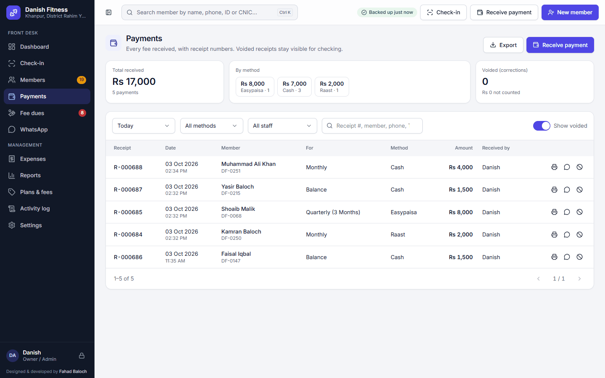
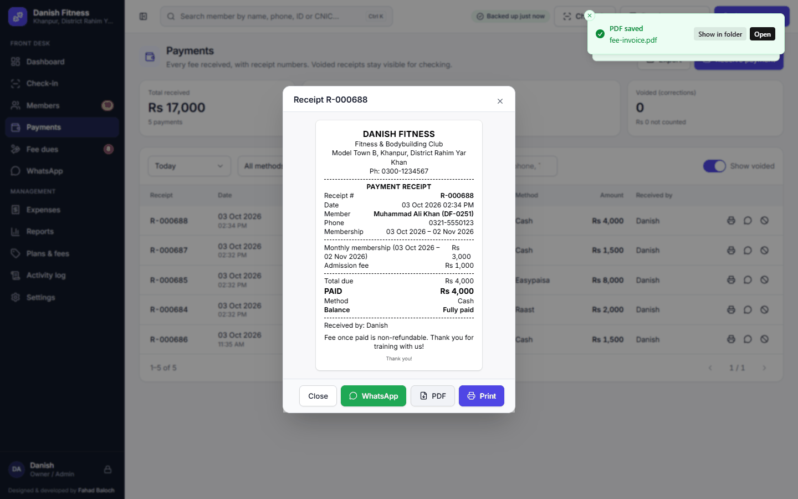
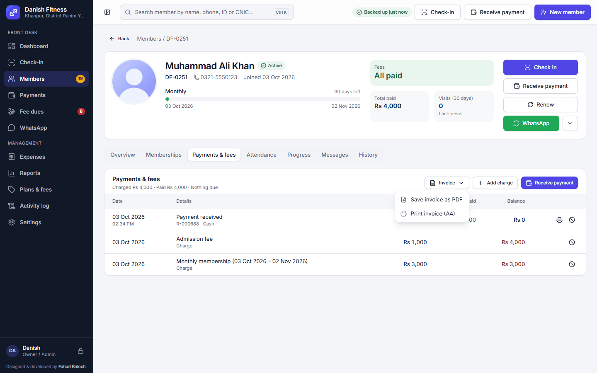
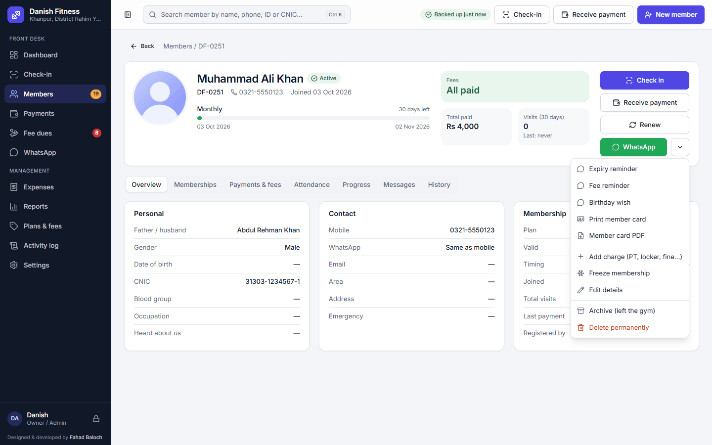
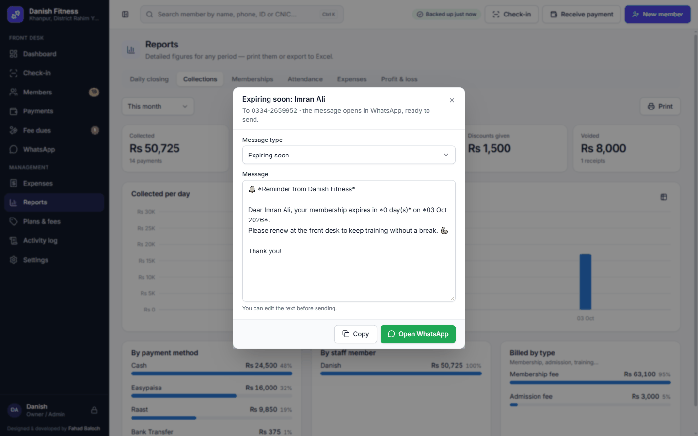
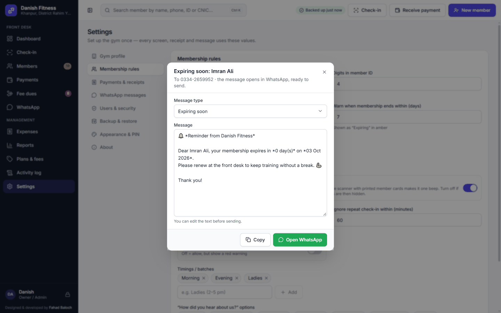

# Danish Fitness — User Guide

For the owner and the front-desk staff. Everything works **without internet**. Each step has a screenshot.

*Designed and developed by Fahad Baloch.*

## Contents

1. [Install](#1-install)
2. [First-time setup](#2-first-time-setup-5-minutes)
3. [Logging in and switching users](#3-logging-in-and-switching-users)
4. [The dashboard](#4-the-dashboard)
5. [Register a new member — F2](#5-register-a-new-member--f2)
6. [Take fees — F3](#6-take-fees--f3)
7. [Receipts, PDFs and printing](#7-receipts-pdfs-and-printing)
8. [Fee invoices and dues](#8-fee-invoices-and-dues)
9. [Renew or freeze a membership](#9-renew-or-freeze-a-membership)
10. [Check-in (attendance) — F4](#10-check-in-attendance--f4)
11. [Member cards](#11-member-cards)
12. [WhatsApp messages](#12-whatsapp-messages)
13. [Expenses](#13-expenses-owner)
14. [Reports](#14-reports)
15. [Backups — your data's safety](#15-backups--your-datas-safety)
16. [Settings](#16-settings)
17. [Fixing mistakes and the activity log](#17-fixing-mistakes-and-the-activity-log)
18. [Troubleshooting](#18-troubleshooting)
19. [Keyboard shortcuts](#19-keyboard-shortcuts)

---

## 1. Install

1. Double-click **`Danish Fitness_1.0.0_x64-setup.exe`**.
2. If Windows says *"Windows protected your PC"*, click **More info → Run anyway** (this appears for new software).
3. It installs in a few seconds. A **Danish Fitness** icon appears on the desktop and in the Start menu.

No administrator password is needed. The gym's data stays on this computer and is backed up automatically.

**Updating to a new version** later: just run the new installer — your data is kept (see [section 15](#15-backups--your-datas-safety)).

## 2. First-time setup (5 minutes)

The first time the app opens it walks you through five short steps. Everything can be changed later in **Settings**.

**Step 1 — Welcome.** Click **Get started**.
Reinstalling, or moving to a new PC? Don't set up again: click **Restore** next to the backup the app found (or
**Choose backup file…** and pick it from the D: drive or a USB drive). Everything comes back — members, fees, history
and staff PINs.

**Step 2 — Gym details.** Name, address and phone (already filled with Danish Fitness, Model Town B, Khanpur). These
are printed on receipts, invoices and member cards, and used in WhatsApp messages.

**Step 3 — Owner account.** Your name and a **PIN** of 4–8 digits. Remember it — write the owner PIN somewhere safe.

**Step 4 — Fees & plans.** The admission fee and the packages (Monthly, Quarterly, Half-yearly, Yearly, Daily pass).
Change the prices to match your gym; add or remove packages.

**Step 5 — Finish.** Check the summary. The last row shows where **backups** will be kept: if the PC has a second
drive, the app picks **`D:\Danish Fitness\Backups`** by itself (safe even if Windows is reinstalled). Click
**Change folder** to choose another place, then **Open Danish Fitness**.

> **Want to practise first?** On a spare PC: **Settings → Backup & restore → Load demo data** fills an empty gym with a
> realistic year of members, payments and check-ins.

## 3. Logging in and switching users

- Type your **PIN** and press **Enter** (when there are several staff, tap your **name** first).
- Click the **lock icon** (bottom-left) when you leave the desk — the next person logs in with their own PIN.
- 5 wrong PINs lock the account for 30 seconds.
- The owner adds receptionists in **Settings → Users & security**. Each person should have their own PIN so the
  **Activity log** shows who did what.

| Role | Can do |
|---|---|
| **Receptionist** | Register members, take fees, renew, freeze, check-in, WhatsApp, print receipts, see today's collection |
| **Owner / Admin** | Everything, plus money reports, expenses, corrections (void), settings, users, restore backups |

## 4. The dashboard

The first screen shows the gym at a glance: active members, today's and this month's collection, fee dues, who is
expiring, who has expired, new members and profit — each with a comparison. **Click any tile** to open the list
behind it. Below are the lists that need attention, each with a **WhatsApp** and an action button.

Scroll down for the charts. Every chart has a **table** button (top-right) to see the exact numbers.

## 5. Register a new member — **F2**

1. Click **New member** (top-right) or press **F2**.
2. Type the **name**, **mobile number** (e.g. `0300-1234567`) and choose **gender**.
   **More details** (father/husband name, CNIC, date of birth, address, emergency contact, injuries…) is optional —
   CNIC and blood group also appear on the member card.
3. **Photo:** click **Webcam → Capture** — the laptop's built-in camera or a USB webcam both work. If the PC has
   more than one camera, choose it in the list under the picture (the app remembers your choice). Or click
   **Upload** to use a picture from the PC (JPG or PNG; phone photos are fine).
4. **Membership & fee:** choose the plan. The start date is today and the end date fills itself. Add a discount if any.
   The **admission fee** is added automatically (set it to 0 to waive).
5. **Payment:** "Paid now" is filled with the full amount — change it if the member pays part now. Choose the method
   (Cash, JazzCash, Easypaisa, Bank Transfer, Raast, Card) and type the transaction ID for digital payments.
6. Click **Save member**, **Save & print** (receipt) or **Save & WhatsApp** (welcome message).

If the phone number or CNIC already exists, a yellow box warns you — family members may share a phone, that is fine.

The member's profile shows everything about them, with tabs for memberships, payments, attendance, body
measurements, messages and history.

### Moving members from the paper register

Click **Existing (from register)** at the top of the New member page. Then:
- type their **old register number** in *Member ID* (or leave it empty for a new number),
- set the **original joining date** and the **current membership start date**,
- enter the fee they already paid. No admission fee is charged and **today's collection is not affected**.

## 6. Take fees — **F3**

- Press **F3** (or **Receive payment** on the member), check the member, type the amount, choose the method.
- **Partial payment:** just type the smaller amount — the rest shows as **Fee due** everywhere.
- **Advance:** paying more than is due is kept as credit and used for the next fee automatically.
- Click **Save**, **Save & print** or **Save & WhatsApp** (the receipt is sent as a message).

## 7. Receipts, PDFs and printing

Receipt numbers are automatic (R-000001, R-000002 …) and never repeat. The **Payments** page lists every payment with
filters and totals:

Open any receipt from **Payments** (receipt icon) or the member's **Payments & fees** tab:

- **Print** — on your receipt printer.
- **PDF** — saves the receipt as a PDF file (to send on WhatsApp or e-mail). A message then offers **Open** and
  **Show in folder**; drag the file from the folder into a WhatsApp chat to send it.
- **WhatsApp** — sends the receipt as a text message.

The PDF receipt looks like this:

**Printer paper:** choose it in **Settings → Payments & receipts** — *Thermal 80 mm*, *Thermal 58 mm* or *A5 (normal
printer)*. In the print window select your printer; for thermal printers set margins to **None** the first time.

## 8. Fee invoices and dues

A **fee invoice** lists what a member was charged, what is paid and what is still due — useful for members who owe
money, or anyone who asks for a bill.

- Member → **Payments & fees** → **Invoice ▾** → **Save invoice as PDF** or **Print invoice (A4)**.

The **Fee dues** page lists everyone who owes money (highest first, or oldest first) with the total due and how old
it is. Each row has an **invoice PDF** button, **Remind** (WhatsApp) and **Collect**.

## 9. Renew or freeze a membership

Open the member (search with **Ctrl K**) → **Renew**. The plan, dates and fee are filled in:
- If the membership is still running, the new one starts the day after it ends (no days lost).
- If it ended recently (within the grace period, default 10 days), the fee date stays the same.
- If it ended long ago, the new membership starts today.

You can change any date before saving. Old dues can be collected in the same payment.

**Freeze (pause):** member profile → **▾** (next to WhatsApp) → **Freeze membership** → number of days. The days are
added to the end date. If the member returns early, open the profile → **Overview → Freezes → End now** and the unused
days are given back.

## 10. Check-in (attendance) — **F4**

**No machine is needed.** The gym can record attendance today with just the keyboard:

- Press **F4**. Type a few letters of the name, the phone number or the member ID and press **Enter** (about
  3 seconds per member).
- The screen shows the member's **photo** (so nobody can use someone else's name) and a colour:
  **Green** = all good. **Amber** = expiring soon or fee due. **Red** = expired / no membership.
- A second check-in within an hour is ignored (no double counting). The right side shows everyone who came today.

**Faster at busy hours — barcode cards (optional).** Buy an inexpensive **USB barcode scanner** (any model works; it
plugs in like a keyboard, no setup) and print [member cards](#11-member-cards). Keep the cursor in the check-in box and
scan the card: one beep and the member is checked in.

**Fingerprint machines** are not connected yet; they can be added later if the gym buys one.

**Not keeping attendance at all?** Turn off **Settings → Membership rules → Record check-ins** ([section 16](#16-settings)).
The check-in screens and attendance figures are then hidden; nothing else changes.

The "**Not visiting**" lists (dashboard and WhatsApp page) start working once check-ins have been recorded for the
number of days set in Membership rules (10 by default) — so nobody is wrongly listed in the first days.

## 11. Member cards

Each card shows the member's photo, name, member ID, phone and — when entered — CNIC, father/husband name, blood
group and timing, with the gym's name, address and phone, and a **barcode** for check-in.

- **One card:** open the member → **▾** → **Print member card** or **Member card PDF**.
- **Many cards:** **Members** → choose a filter (e.g. **Active**) → **Print cards** → **Print** (A4, ten cards per
  sheet — cut out and laminate) or **Save PDF** (take it to a print shop to print on PVC cards).

## 12. WhatsApp messages

- Every **WhatsApp** button opens WhatsApp with the message already typed — check it and press **Send** in WhatsApp.
- The **WhatsApp** page (left menu) has ready lists: *Expiring soon, Expired, Fee due, Birthdays, Not visiting*.
  It shows when each member was last reminded, so nobody is messaged twice by mistake.

- Change the wording in **Settings → WhatsApp messages** — English or Roman Urdu ready-made texts are available, and
  the preview shows exactly what the member will see.
- If WhatsApp Desktop is not installed, choose **WhatsApp Web** in the same settings.

## 13. Expenses (owner)

**Expenses → Add expense**: category (Rent, Electricity, Salaries…), amount, date, paid to. Expenses are needed for the
**profit** figures on the dashboard and in reports.

## 14. Reports

Open **Reports** and pick a tab. Every report can be **printed**; lists can be exported to Excel (CSV).

- **Daily closing** — print at the end of the day: total collected, cash vs JazzCash/Easypaisa, the cash that should
  be in the drawer, payments by staff member, voided receipts and expenses.

- **Collections** — money received per day, by method and by staff member.

- **Memberships** — new members, renewals, members who left and the renewal rate.

- **Attendance**, **Expenses** and **Profit & loss** (income vs expenses per month).

## 15. Backups — your data's safety

**Where things are kept**

| What | Where |
|---|---|
| The gym's data (one file) | `C:\Users\<you>\AppData\Roaming\com.danishfitness.desk\danish-fitness.db` |
| Automatic backups | The folder chosen at setup — normally **`D:\Danish Fitness\Backups`** (a different drive from Windows) |
| Second copy (optional) | A USB drive or a Google Drive folder you choose |

- The app **backs up automatically** when it starts, every few hours while data changes, and when you close it.
  The last 30 automatic copies are kept; copies you make yourself are never deleted.
- **Settings → Backup & restore → Back up now** makes an extra copy any time.
- If backups are on the same drive as Windows, Settings shows a tip with a button to move them to the other drive.
- **Strongly recommended:** plug in a USB drive and set it as the **Second copy** folder — every backup is copied
  there too. Keep the USB away from the PC (theft, fire).
- The data survives power cuts (load-shedding): anything saved before the light went is safe.

**Installing a new version** — just run the new installer. It replaces only the program; the data is not touched.
The first time the new version opens, it saves a "**Before update**" backup automatically.

**Uninstalling and installing again** — the data stays on the PC, so after installing again the app opens with
everything as before. Even if someone ticks **"Delete the application data"** in the uninstaller, a copy of the data
is saved first in `Documents\Danish Fitness\Backups` (and in the backup folder) — marked "**Before uninstall**".

**New PC, or Windows was reinstalled** — install the app, then on the first page click **Restore** next to the backup
it finds on the D: drive, or **Choose backup file…** to pick one from a USB drive. Log in with the same PIN.

**Restore an older copy** — Settings → Backup & restore → choose a backup → **Restore** (owner only). The current data
is saved first ("Before restore"), so a restore can always be undone.

## 16. Settings

**Settings** (owner) has sections for the gym profile and logo, **membership rules**, payments & receipts, WhatsApp
messages, users & security, backup & restore, appearance and about.

In **Membership rules** you set the member ID prefix, when a membership counts as "expiring", the late-renewal grace
period, the default admission fee, the "not visiting" days, and whether to **record check-ins** at all.

## 17. Fixing mistakes and the activity log

Nothing about money is ever deleted — mistakes are **voided** with a reason, and the voided receipt stays visible
(this protects the owner and honest staff).

| Mistake | Fix (owner/admin) |
|---|---|
| Payment entered twice / wrong amount | Payments → ⊘ **Void** → enter the correct payment again |
| Wrong membership dates | Member → Memberships → ✎ **Correct dates** |
| Membership should not exist | Member → Memberships → ⊘ **Cancel** (fee is removed; money paid stays as credit) |
| Wrong check-in | Member → Attendance → 🗑 remove |
| Member registered twice by mistake | Archive one (or delete it if it has no payments) |
| Member left the gym | Member → ▾ → **Archive** (renewing later brings them back) |

The **Activity log** shows who did what and when — it cannot be edited or deleted.

## 18. Troubleshooting

| Problem | Solution |
|---|---|
| Red bar: *"The computer's date looks wrong"* | Fix the Windows date/time (right-click the clock → Adjust date/time). The PC battery may be weak. |
| Webcam does not start | Close other apps using the camera (Zoom, WhatsApp, Camera). If the app says Windows is blocking it, click **Camera settings** and turn on camera access for desktop apps. Some laptops have a camera key or a sliding cover. Or use **Upload**. |
| Scanner beeps but nothing happens | Click inside the check-in box first, so the scanned number goes there. |
| WhatsApp does not open | Install WhatsApp Desktop from the Microsoft Store, or switch to **WhatsApp Web** in settings. |
| Sending a PDF on WhatsApp | After **PDF**, click **Show in folder** and drag the file into the WhatsApp chat. |
| Receipt prints too small/large | Choose the correct paper in Settings → Payments & receipts; set margins to None. |
| Forgot PIN | The owner resets it in Settings → Users & security → **PIN**. |
| Owner forgot PIN | Restore needs the owner — keep the owner PIN written somewhere safe. |

## 19. Keyboard shortcuts

| Key | Action |
|---|---|
| **F2** | New member |
| **F3** | Receive payment |
| **F4** | Check-in |
| **Ctrl + K** | Search members (name, phone, ID or CNIC) and jump anywhere |
| **Esc** | Close a window |

---

© 2026 Danish Fitness. Designed and developed by Fahad Baloch.
